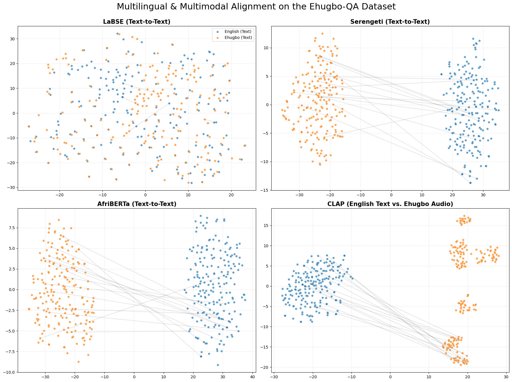

# Ehugbo-QA: A Multimodal Benchmark for Cross-Dialect Information Retrieval (CDIR)

**Ehugbo-QA** is the first dedicated multimodal benchmark for evaluating information access in the **Ehugbo** dialect (the Afikpo variety of Igbo, spoken in Ebonyi State, Nigeria). 

This repository provides the dataset and diagnostic evaluation suite used to identify the **"Alignment Gap"**—a systemic failure in regional African foundation models to bridge the semantic space between high-resource queries and dialectal documents.

## 📊 Final Leaderboard (Zero-Shot)
We evaluate models on a **1-vs-312 Global Gallery Retrieval** task, matching English text queries to Ehugbo documents.

| Model Class | Model Name | Task | Top-1 Accuracy | MRR |
| :--- | :--- | :--- | :--- | :--- |
| **Global Bi-Encoder** | **LaBSE** | Text-to-Text | **85.26%** | **0.8990** |
| **Regional MLM** | Serengeti-E250 | Text-to-Text | 4.17% | 0.0789 |
| **Regional MLM** | AfriBERTa | Text-to-Text | 1.28% | 0.0610 |
| **Multimodal** | CLAP | Text-to-Audio | 0.32% | 0.0229 |

---

## 🔍 Key Diagnostic Findings

### 1. The Alignment Gap (Visualized)
Our t-SNE analysis reveals a stark contrast in embedding topology. While **LaBSE** achieves language invariance (merging English and Ehugbo), regional models like **Serengeti** exhibit "Disconnected Islands." 

**Figure 1: Multimodal & Multilingual Alignment Comparison**


*   **Left (LaBSE):** Integrated semantic space.
*   **Right (Serengeti):** Segregated linguistic islands with a massive "no-man's land" in the middle.

### 2. The Hubness Phenomenon
Qualitative error probing shows that unaligned models (Serengeti/AfriBERTa) suffer from **Hubness**. In our tests, Serengeti incorrectly mapped diverse theological queries to a single "hub" verse regarding baptism with **94.7% confidence**.

---

## 📂 Repository Contents
- `data/ehugbodataset.csv`: The parallel corpus of 312 verses (Ehugbo audio links, transcripts, and English translations).
- `notebooks/Ehugbo_Experiments.ipynb`: Full implementation of the retrieval suite, pooling strategies, and visualization code.
- `figures/`: High-resolution t-SNE plots comparing semantic spaces.

## 🛠️ Requirements
To reproduce these results, install the following:
```bash
pip install pandas torch sentence-transformers transformers librosa matplotlib scikit-learn
```

## 📖 Citation
If you use this benchmark or the "Alignment Gap" analysis in your research, please cite us
